<!-- ================================================================== -->
<!--                    ⚡ HAROON AHMAD - GITHUB PROFILE README          -->
<!--            Cyber Security Expert | DevSecOps | Cloud Architect       -->
<!--              Build Date: April 2026 | Version 5.0                   -->
<!-- ================================================================== -->

<!-- ===================== 🎬 HERO CAPSULE BANNER ===================== -->


<!-- ===================== ⌨️ ANIMATED TYPING SVG ===================== -->

<div align="center">


<br><br>

<!-- ===================== 🏷️ STATUS BADGES ROW ===================== -->


<br><br>


<br><br>


</div>

<!-- ===================== 📊 VISITOR COUNTER & STATS TOP BAR ===================== -->

<div align="center">

<h3>📊 Profile Analytics & Visitor Tracking</h3>


<br><br>


</div>


<!-- ===================== 📑 TABLE OF CONTENTS ===================== -->

## 📑 Table of Contents

> 🗂️ **Navigate this profile with ease** — Click any section below to jump directly.

| # | Section | Description |
|---|---------|-------------|
| 01 | [**🎯 Hero Banner**](#-hero-banner) | Professional profile banner visualization |
| 02 | [**👨‍💻 About Me**](#-about-me) | Professional background, mission, and philosophy |
| 03 | [**🌐 Quick Connect**](#-quick-connect) | Social media and contact badges |
| 04 | [**📌 Portfolio Snapshot**](#-portfolio-snapshot) | Key metrics and achievement highlights |
| 05 | [**📊 Master Skill Matrix**](#-master-skill-matrix) | Comprehensive skill assessment with progress bars |
| 06 | [**🎯 Core Expertise Domains**](#-core-expertise-domains) | Deep dive into specializations |
| 07 | [**🏗️ Architecture Visualizations**](#-architecture-visualizations--svg-workflow-diagrams) | SVG workflow diagrams with descriptions |
| 08 | [**📈 GitHub Stats Dashboard**](#-github-stats-dashboard) | Stats, streaks, trophies, and activity graph |
| 09 | [**🛠️ Tech Stack Arsenal**](#-️-tech-stack-arsenal) | Massive badge collection by category |
| 10 | [**🎓 Certifications & Compliance**](#-certifications--compliance) | Professional certifications and standards |
| 11 | [**🚀 Featured Projects**](#-featured-projects) | 8 detailed project showcases |
| 12 | [**📝 Blog & Research**](#-blog--research) | Latest articles and research topics |
| 13 | [**💼 Professional Services**](#-professional-services) | Consulting and service offerings |
| 14 | [**🏆 Achievements & Recognition**](#-achievements--recognition) | Milestones, CVEs, and conference talks |
| 15 | [**🔗 Connect & Contact**](#-connect--contact) | Full contact information and social links |
| 16 | [**🙏 Footer**](#-footer) | Closing and credits |


<!-- ===================== 🎯 HERO BANNER ===================== -->

## 🎯 Hero Banner

<div align="center">


<p>
  
</p>

</div>


<!-- ===================== 👨‍💻 ABOUT ME ===================== -->

## 👨‍💻 About Me

<div align="center">


</div>

```yaml
---
name: Haroon Ahmad
github: lazzyroot505
title: Cyber Security Expert | DevSecOps Engineer | Cloud Security Architect | AI/ML Security Specialist
location: Pakistan 🇵🇰
experience: "4+ Years Production-Grade (Since 2021)"
education: "EduQual-Accredited — Diploma in AIOps (Level 6, RQF Level 6, UK Bachelor's Equivalent)"
current_role: "Senior Security Engineer & Cloud Architect"

domains:
  offensive_security:
    - Web & Mobile Penetration Testing (OWASP WSTG)
    - Advanced Persistent Threat (APT) Simulation
    - Red Team Operations & Adversary Emulation
    - Exploit Development & Privilege Escalation
    - Social Engineering & Phishing Campaigns
    - Network Reconnaissance & OSINT Automation
  defensive_security:
    - Security Operations Center (SOC) Design & Management
    - SIEM Implementation & Log Analysis (Splunk, Wazuh, ELK)
    - Incident Response & Digital Forensics
    - Threat Hunting & Threat Intelligence Analysis
    - Malware Analysis & Reverse Engineering
    - Blue Team Exercises & Purple Team Coordination
  cloud_security:
    - Multi-Cloud Architecture (AWS, Azure, GCP, Oracle, Huawei)
    - Infrastructure as Code Security (Terraform, CloudFormation)
    - Cloud Security Posture Management (CSPM)
    - Identity & Access Management (IAM) Governance
    - Cloud Compliance Automation & Policy-as-Code
    - Container Security & Kubernetes Hardening
  devsecops:
    - Secure CI/CD Pipeline Architecture & Design
    - SAST/DAST/SCA Integration & Automation
    - Container & Image Security Scanning
    - Secrets Management & Supply Chain Security
    - Policy-as-Code (OPA, Checkov, Sentinel)
    - DevSecOps Culture Transformation & Training
  ai_ml_security:
    - Machine Learning Threat Detection Systems
    - AI-Driven Incident Response Automation
    - NLP-Based Log Analysis & Alert Classification
    - Predictive Analytics for Vulnerability Prioritization
    - Adversarial ML Defense & Model Security
    - AIOps Pipeline Design & Deployment
  industrial_security:
    - SCADA/ICS Network Architecture & Segmentation
    - PLC/RTU Hardening & Firmware Integrity Verification
    - Industrial Protocol Analysis (Modbus, DNP3, OPC-UA)
    - OT Intrusion Detection & Anomaly Detection
    - Safety Instrumented Systems (SIS) Security Assessment
    - IEC 62443 Compliance & Implementation
  compliance:
    - PCI/DSS Assessment & QSA Preparation
    - ISO 27001 Implementation & Audit Readiness
    - CIS Controls & Benchmarks Automation
    - NIST Cybersecurity Framework Alignment
    - SOC 2 Type I & Type II Readiness
    - HIPAA & GDPR Compliance Frameworks

current_mission:
  - "Building AI-driven resilient security infrastructure for enterprise environments"
  - "Architecting secure multi-cloud environments with zero-trust principles"
  - "Automating threat detection, incident response, and compliance verification"
  - "Advancing SCADA/ICS security for critical infrastructure protection"
  - "Pioneering AIOps integration within DevSecOps pipelines"

approach: "Architect → Harden → Automate → Monitor → Defend → Evolve"
philosophy: "Automate fearlessly, defend relentlessly, build intelligently."
motto: "If it's not automated, it's technical debt. If it's not monitored, it's a blind spot. If it's not secure, it's a liability. If it's not AI-augmented, it's legacy."

languages:
  - Python (Expert)
  - Bash (Expert)
  - PowerShell (Advanced)
  - Go (Proficient)
  - JavaScript (Proficient)
  - YAML/JSON (Expert)
---
```

### 🚀 Professional Bio

I'm **Haroon Ahmad** — a **Cyber Security Expert**, **DevSecOps Engineer**, **Cloud Security Architect**, and **AI/ML Security Specialist** with over **4 years of battle-tested, production-grade experience** spanning the full spectrum of cybersecurity, cloud infrastructure, DevSecOps, and AI-driven intelligent automation. I build systems that are not just **scalable** — they are **secure by design**, **observable by default**, and **resilient by architecture**.

Since **2021**, I have operated at the bleeding edge of **cyber defense**, advancing from foundational security principles through **offensive and defensive operations**, **multi-cloud hardening**, and **AI-powered threat detection**. My expertise spans the **full kill chain** — from **penetration testing** and **VAPT** to **SOC-ready monitoring stacks**, **SIEM ecosystems**, and **production-grade AIOps pipelines**. I have conducted over **1,000 security assessments**, deployed over **500 cloud environments**, and built over **200 CI/CD pipelines** — all with security baked in from day one.

I architect and manage **secure, resilient multi-cloud platforms** on **AWS, Azure, GCP, Oracle Cloud, and Huawei Cloud**, leveraging **Terraform**, **Ansible**, **Kubernetes**, and **Jenkins** to enforce infrastructure-as-code consistency. I integrate **SIEM ecosystems** like **Wazuh**, **Splunk**, and **ELK** for real-time visibility, while deploying **machine learning models** (TensorFlow, PyTorch) within **CI/CD workflows** for predictive analytics and automated remediation. My work has directly contributed to **zero breaches** across all environments I have managed.

My work spans both **Red and Blue domains** with a **Purple Team methodology** — conducting **web/mobile pentesting** using **OWASP WSTG**, automating reconnaissance with **Python + Selenium**, simulating **APTs** with **Cobalt Strike**, and building **SOC-ready monitoring stacks** with **Grafana**, **Nagios**, **Zabbix**, and **Prometheus**. I specialize in **SCADA/ICS security** for critical infrastructure protection, **PCI/DSS compliance** for payment card industry standards, and **CCSP-aligned cloud security architectures** for enterprise governance.

I am completing an **EduQual-accredited progression** from **Diploma in Cloud Cyber Security (Level 3)** through to **Diploma in AIOps (Level 6)** — benchmarked to a **UK Bachelor's degree (RQF Level 6)**. This academic foundation, combined with my extensive hands-on experience, positions me as a **well-rounded security professional** capable of addressing both tactical and strategic security challenges.

### 💡 Philosophy & Approach

> ⚡ *"If it's not automated, it's technical debt. If it's not monitored, it's a blind spot. If it's not secure, it's a liability. If it's not AI-augmented, it's legacy."*

> 🔥 *"Security is not a product — it is a process. A process that must be continuous, adaptive, intelligent, and deeply integrated into every layer of the technology stack."*

> 🚀 *"I don't just find vulnerabilities — I architect systems where vulnerabilities have nowhere to hide. Every pipeline I build has security gates. Every cloud I deploy has zero-trust. Every incident I respond to feeds back into stronger defenses."*

My approach follows a proven methodology: **Architect → Harden → Automate → Monitor → Defend → Evolve**. This cyclical, defense-in-depth strategy ensures that security is never an afterthought but a foundational pillar of every system, pipeline, and infrastructure I design. I believe in **shifting security left**, **automating everything automatable**, and **leveraging AI to stay ahead of adversaries who are themselves becoming more sophisticated.


<!-- ===================== 🌐 QUICK CONNECT ===================== -->

## 🌐 Quick Connect

<div align="center">

<p>
  <a href="https://www.linkedin.com/in/info-haroon">
    
  </a>
  <a href="https://twitter.com/haroon_ahmad">
    
  </a>
  <a href="mailto:haroon.ahmad@example.com">
    
  </a>
  <a href="https://github.com/lazzyroot505">
    
  </a>
  <a href="#">
    
  </a>
</p>

<p>
  
  
  
</p>

</div>


<!-- ===================== 📌 PORTFOLIO SNAPSHOT ===================== -->

## 📌 Portfolio Snapshot

<div align="center">

| 🔐 Portfolio Dimension | 📈 What It Represents | 🏆 Scale |
|---|---|---|
| **50+ Structured Repositories** | Capstone projects, security labs, DevOps pipelines, AI automation, and production-grade documentation |  |
| **1000+ Security Assessments** | Penetration tests, vulnerability assessments, compliance audits, threat modeling sessions, and security reviews |  |
| **500+ Cloud Deployments** | Multi-cloud infrastructure provisioning across AWS, Azure, GCP, Oracle Cloud, and Huawei Cloud |  |
| **200+ CI/CD Pipelines** | Secure DevSecOps pipelines with SAST, DAST, SCA, container scanning, and compliance gates |  |
| **Multi-Cloud Architecture Depth** | AWS, Azure, GCP, Oracle Cloud, Huawei Cloud — cross-cloud orchestration, migration, and hardening |  |
| **DevSecOps Pipeline Mastery** | Jenkins, Docker, Kubernetes, Terraform, Ansible, CI/CD security gates, automated compliance |  |
| **Offensive & Defensive Security** | Red Team, Blue Team, Purple Team — pentesting, VAPT, SOC operations, threat hunting, IR |  |
| **AIOps & AI-Integrated Security** | TensorFlow, PyTorch, ML-powered detection, predictive analytics, automated incident response |  |
| **Industrial & Compliance Security** | SCADA/ICS, PCI/DSS, ISO 27001, CIS Controls, CCSP-aligned architectures |  |
| **Monitoring & Observability Stack** | Grafana, Nagios, Zabbix, Prometheus, ELK — full-spectrum infrastructure visibility |  |
| **Documentation-First Engineering** | Architecture diagrams, runbooks, incident playbooks, compliance reports, technical blogs |  |
| **Zero Breach Record** | All environments managed have maintained a zero-breach security posture |  |

</div>


<!-- ===================== 📊 MASTER SKILL MATRIX ===================== -->

## 📊 Master Skill Matrix

> 🔥 This matrix reflects my **production-grade hands-on implementation** across cybersecurity, cloud security, DevSecOps, AIOps, and AI-integrated security. Each skill has been validated through **real-world engagements**, **enterprise deployments**, and **continuous professional development**. Progress bars indicate the **current depth of practical implementation** in production environments.

| # | Skill Domain | Expertise Level | Practical Depth | Tools & Technologies |
|---|---|---:|---|---|
| 1 | 🔴 **Offensive Security** | ██████████ **100%** | Expert-level web/mobile/API penetration testing following OWASP WSTG methodology. I have conducted 500+ assessments including authenticated and unauthenticated testing, business logic flaw analysis, session management testing, and advanced exploitation chains. Proficient in APT simulation, red team operations, social engineering campaigns, and exploit development. Experienced with Cobalt Strike command-and-control frameworks, Metasploit module development, and custom exploit tooling using Python and Go. | Metasploit, Burp Suite Pro, Nmap, Wireshark, Kali Linux, OWASP ZAP, John the Ripper, Hashcat, Hydra, SQLMap, Cobalt Strike, Bloodhound, Gobuster, Nikto, Nuclei, Custom Python Scripts |
| 2 | 🟢 **Defensive Security** | ██████████ **100%** | I have designed, deployed, and managed Security Operations Centers (SOCs) for enterprise environments. My defensive capabilities include SIEM implementation and tuning (Splunk, Wazuh, ELK), real-time alert triage and escalation, incident response playbooks, threat hunting using MITRE ATT&CK frameworks, digital forensics with Volatility and Autopsy, malware analysis and reverse engineering, and blue team exercise coordination. I have maintained zero false-negative rates in critical alert categories through continuous detection engineering. | Wazuh, Splunk Enterprise, Elastic Stack (ELK), OSSEC, Snort, Suricata, Zeek, Security Onion, TheHive, MISP, Cortex, YARA, Sigma, Osquery, Volatility, Autopsy |
| 3 | ☁️ **Cloud Security — AWS** | █████████░ **95%** | I architect and secure AWS environments with production-grade configurations. I have deployed over 200 AWS environments including VPC design with security groups and NACLs, IAM policies with least-privilege principles, AWS Security Hub integration, GuardDuty threat detection, Config Rules for compliance, CloudTrail log analysis, KMS encryption management, S3 bucket policies and encryption, WAF & Shield DDoS protection, and Lambda-based security automation. I implement CIS AWS Foundations Benchmark across all deployments. | AWS Security Hub, GuardDuty, Config, CloudTrail, IAM, KMS, WAF, Shield, Inspector, Macie, CloudWatch, Lambda, SNS, S3, VPC, Organizations SCPs |
| 4 | ☁️ **Cloud Security — Azure** | █████████░ **95%** | I design and harden Azure environments for enterprise workloads. My Azure security implementations include Azure Sentinel SIEM deployment with custom analytics rules, Azure Key Vault for secrets management, Azure Policy for governance, Azure AD conditional access policies, Network Security Groups and Application Gateway WAF, Azure Monitor with Log Analytics workspaces, Defender for Cloud vulnerability assessment, and Azure DevOps pipeline security with branch protection and build validation. | Azure Sentinel, Azure AD, Key Vault, Azure Policy, Defender for Cloud, Network Watcher, Log Analytics, Application Gateway WAF, Azure DevOps, Azure Monitor, Blob Storage Security |
| 5 | ☁️ **Cloud Security — GCP** | ████████░░ **90%** | I implement Google Cloud security architectures with Security Command Center (SCC) as the central visibility plane. I configure VPC Service Controls for data exfiltration prevention, Cloud IAM with organization policies, Binary Authorization for container deployment security, Cloud KMS for encryption key management, Stackdriver for logging and monitoring, and Forseti Security for policy enforcement and compliance automation across GCP resources. | GCP Security Command Center, Cloud IAM, VPC Service Controls, Binary Authorization, Cloud KMS, Forseti Security, Stackdriver, Cloud Armor, Chronicle SIEM, Data Loss Prevention API |
| 6 | ☁️ **Cloud Security — Oracle** | ████████░░ **90%** | I design Oracle Cloud Infrastructure (OCI) security architectures leveraging the OCI Security Advisor and Cloud Guard for proactive threat detection. I implement IAM compartments with granular access controls, Web Application Firewall for OWASP Top 10 protection, Vault service for secrets and encryption keys, Audit service for compliance logging, Network Security Groups for micro-segmentation, and Bastion service for secure access to compute instances. | OCI Cloud Guard, Security Advisor, IAM Compartments, WAF, Vault Service, Audit Service, Network Security Groups, Bastion, Data Safe, OS Management |
| 7 | ☁️ **Cloud Security — Huawei** | ████████░░ **85%** | I configure Huawei Cloud security services including Identity and Access Management (IAM) with fine-grained RBAC policies, Web Application Firewall (WAF) for web application protection, Anti-DDoS for volumetric attack mitigation, Cloud Eye for monitoring and alerting, and Log Tank Service (LTS) for centralized log management. I implement security group policies and Network ACLs for network segmentation. | Huawei IAM, WAF, Anti-DDoS, Cloud Eye, Log Tank Service (LTS), Security Group, Network ACL, Key Management Service, Data Encryption, Vulnerability Scanning |
| 8 | 🔐 **PCI/DSS Compliance** | █████████░ **95%** | I have led PCI/DSS compliance programs for organizations handling payment card data. My implementations cover all 12 PCI/DSS requirements including network segmentation for cardholder data environments (CDE), firewall rule management and testing, secure configuration hardening, encryption of cardholder data in transit and at rest, vulnerability management programs with quarterly scans, strong access control measures, logging and monitoring mechanisms, and incident response procedures. I have prepared organizations for QSA audits and maintained continuous compliance. | Qualys, Nessus, OpenVAS, AWS Config, PCI-DSS v4.0, SAQ (Self-Assessment Questionnaire), Network Segmentation, Encryption Standards, Tokenization, Access Control Matrix |
| 9 | 🏭 **SCADA/ICS Security** | █████████░ **95%** | I secure Industrial Control Systems (ICS) and SCADA networks for critical infrastructure. I design OT/IT network segmentation architectures following Purdue Model layering, deploy industrial protocol analyzers for Modbus, DNP3, and OPC-UA traffic inspection, implement PLC/RTU hardening procedures with firmware integrity verification, create ICS-specific intrusion detection rules using Suricata and Zeek, and perform safety instrumented system (SIS) security assessments aligned with IEC 62443. I have conducted vulnerability assessments on live SCADA environments in manufacturing and energy sectors. | Claroty, Nozomi Networks, Dragos, CyberX, Wireshark, Scapy, OpenPLC, Modbus, DNP3, OPC-UA, IEC 62443, NIST SP 800-82, Suricata ICS Rules |
| 10 | 🚀 **DevSecOps** | ██████████ **100%** | I architect secure CI/CD pipelines with security integrated at every stage. My DevSecOps implementations include pre-commit hooks for secret detection, SAST scanning with SonarQube and Semgrep, DAST scanning with OWASP ZAP and Burp Suite, SCA with Trivy and Snyk, container image scanning and signing, Kubernetes admission controllers with OPA/Gatekeeper, secrets management with HashiCorp Vault, policy-as-code with Checkov and tfsec, and automated compliance reporting. I have built 200+ production-grade pipelines with zero security incidents. | Jenkins, GitHub Actions, GitLab CI, ArgoCD, Docker, Kubernetes, Terraform, Ansible, SonarQube, OWASP ZAP, Trivy, Snyk, Checkov, tfsec, OPA/Gatekeeper, Vault, SOPS, Sigstore |
| 11 | 🐳 **Container Security** | █████████░ **95%** | I implement comprehensive container security programs covering the entire container lifecycle. My approach includes base image hardening with Distroless and Alpine, image scanning with Trivy and Anchore for CVE detection, runtime security monitoring with Falco and Sysdig for syscall-level threat detection, Kubernetes RBAC and network policies for micro-segmentation, service mesh security with Istio for mTLS and authorization policies, admission controllers for deployment-time policy enforcement, and supply chain security with Sigstore image signing and SBOM generation. | Docker, Kubernetes, Helm, Istio, Falco, Sysdig, Aqua Security, Prisma Cloud, Anchore, Clair, Trivy, OPA/Gatekeeper, Sigstore, cosign, SBOM, Distroless |
| 12 | 🤖 **AIOps & ML Security** | ████████░░ **90%** | I design and deploy AI/ML-powered security systems for intelligent threat detection and automated response. My implementations include TensorFlow and PyTorch models for network anomaly detection achieving 97%+ accuracy, NLP-based log analysis for automated alert classification using transformers, predictive analytics for vulnerability prioritization based on exploit availability and asset criticality, Splunk ML Toolkit for behavioral anomaly detection, and automated incident triage workflows that reduce MTTD by 85% and MTTR by 60%. I integrate ML models directly into CI/CD pipelines for continuous security assessment. | TensorFlow, PyTorch, scikit-learn, MLflow, LangChain, Splunk ML, Elastic ML, Darktrace, Pandas, NumPy, Jupyter, Keras, Hugging Face, OpenCV, NLP, RAG |
| 13 | 📊 **SIEM & Monitoring** | ██████████ **100%** | I design and manage enterprise SIEM ecosystems with multi-source log aggregation, real-time correlation rules, threat intelligence enrichment, and automated incident response. My implementations include Wazuh for endpoint detection and response, Splunk Enterprise for advanced analytics and dashboards, ELK Stack for scalable log ingestion and visualization, custom detection rules using Sigma format, automated alerting with PagerDuty and Slack integrations, and log retention policies meeting PCI/DSS and ISO 27001 requirements. I have processed over 10TB of security logs daily in production SIEM deployments. | Wazuh, Splunk Enterprise, Elastic Stack (Elasticsearch, Logstash, Kibana), Security Onion, Fluentd, Fluent Bit, Logstash Pipelines, Sigma Rules, MITRE ATT&CK Mapping |
| 14 | 🌐 **Network Security** | ██████████ **100%** | I architect secure network infrastructures with defense-in-depth strategies. My implementations include next-generation firewall (NGFW) configurations with Palo Alto and Fortinet, network segmentation with VLANs and VRFs, VPN tunnel management (IPSec, WireGuard, OpenVPN), intrusion prevention systems (IPS) with Snort and Suricata, deep packet inspection (DPI) for threat detection, DNS security with Pi-hole and DNS filtering, and network traffic analysis with Wireshark and Zeek. I perform regular network security assessments and implement zero-trust network architectures. | Wireshark, Nmap, Zeek, Snort, Suricata, pfSense, Fortinet, Palo Alto, TCPDump, Nginx, HAProxy, WireGuard, OpenVPN, DNS Security, VLAN, VRF, BGP, OSPF |
| 15 | 🔍 **Threat Intelligence** | █████████░ **95%** | I build and operationalize threat intelligence programs that transform raw threat data into actionable intelligence. My implementations include MISP (Malware Information Sharing Platform) for threat indicator management, automated IOC enrichment using VirusTotal, Shodan, and AbuseIPDB APIs, MITRE ATT&CK framework mapping for adversary profiling, threat hunting campaigns using Atomic Red Team and CALDERA, dark web monitoring for credential leak detection, and intelligence-driven detection rule creation. I maintain threat intelligence feeds and contribute to community threat sharing initiatives. | MISP, MITRE ATT&CK, Atomic Red Team, CALDERA, Shodan, Censys, VirusTotal, AbuseIPDB, MalwareBazaar, ThreatConnect, Anomali, OpenCTI, Sigma, YARA |
| 16 | 🛡️ **Incident Response** | ██████████ **100%** | I lead incident response operations following the NIST SP 800-61 framework (Preparation, Detection & Analysis, Containment/Eradication/Recovery, Post-Incident Activity). I have developed comprehensive IR playbooks for ransomware, data breaches, insider threats, DDoS attacks, and APT campaigns. My IR capabilities include digital forensics with Volatility and Autopsy, memory analysis, network forensics with Zeek, malware sandboxing, evidence preservation with chain of custody documentation, stakeholder communication management, and lessons learned workshops. I have managed over 100 incident response engagements with average containment time under 4 hours. | TheHive, Cortex, MISP, Splunk, Wazuh, Volatility, Autopsy, Zeek, YARA, NIST SP 800-61, SANS IR, Playbook Automation, PagerDuty, Slack IR Workflows |
| 17 | 🔧 **Automation — Python** | ██████████ **100%** | I write production-grade Python automation for security operations, infrastructure management, and tool development. My Python implementations include custom reconnaissance frameworks with Selenium and requests, automated vulnerability scanning pipelines, SIEM API integrations for automated alert management, machine learning pipelines for threat detection, cloud security posture auditing scripts, compliance reporting automation, Docker and Kubernetes management SDKs, and CI/CD pipeline trigger automation. I follow PEP 8 standards, implement comprehensive error handling, and use type hints for maintainability. | Python 3.10+, Requests, Selenium, BeautifulSoup, Scapy, Paramiko, Boto3, Azure SDK, GCP Client Libraries, TensorFlow, PyTorch, Pandas, NumPy, Flask, FastAPI, Pytest |
| 18 | 🔧 **Automation — Bash** | ██████████ **100%** | I write robust Bash scripts for system administration, security hardening, and CI/CD pipeline orchestration. My Bash implementations include automated Linux hardening scripts (CIS benchmarks), log rotation and archival automation, backup and disaster recovery scripts, user and access management automation, network configuration and firewall rule deployment, Docker container management scripts, Kubernetes cluster maintenance automation, and cron-based security scanning schedules. All scripts include proper error handling, logging, and idempotent execution patterns. | Bash 5.x, GNU Coreutils, awk, sed, grep, cron, systemd, Docker CLI, kubectl, helm, terraform CLI, ansible-playbook, ssh, rsync, jq |
| 19 | 📋 **ITSM — Jira** | █████████░ **95%** | I configure and optimize Jira Service Management for security operations workflows. My implementations include custom workflow designs for incident response, vulnerability management, and change management processes, automated ticket creation from SIEM alerts, SLA tracking and escalation rules, security dashboard configurations with custom JQL queries, integration with Confluence for runbook documentation, and reporting automation for compliance audits. I implement Jira as the single pane of glass for all security operations ticketing. | Jira Service Management, Confluence, JQL, Custom Workflows, SLA Rules, Automation Rules, API Integration, Dashboard Configuration, Reporting, Sprint Planning |
| 20 | 📊 **Observability — Grafana** | █████████░ **95%** | I design comprehensive Grafana dashboards for security monitoring, infrastructure observability, and business intelligence. My Grafana implementations include real-time security operations dashboards with alert correlation panels, infrastructure health monitoring with Prometheus datasource integration, log analytics dashboards with Elasticsearch/Loki datasources, custom panel plugins for threat visualization, templated dashboards for multi-tenant environments, and alerting rules with PagerDuty and Slack notification channels. I maintain over 50 production Grafana dashboards across security and operations domains. | Grafana, Prometheus, Loki, Elasticsearch, InfluxDB, Temporal, Alerting Rules, Dashboard Templates, Panel Plugins, Data Sources, Annotations, Variables |
| 21 | 📊 **Observability — Nagios** | ████████░░ **90%** | I configure Nagios for comprehensive infrastructure and security monitoring. My Nagios implementations include host and service monitoring for 500+ endpoints, custom NRPE plugins for security-specific checks (file integrity, rootkit detection, SSL certificate expiry), distributed monitoring with Nagios Remote Data Replication, passive service checks for SIEM alert integration, business process monitoring dashboards, and automated escalation workflows. I write custom Nagios plugins in Python and Bash for specialized security monitoring requirements. | Nagios Core, Nagios XI, NRPE, NSClient++, Nagios Plugins, Custom Plugin Development, Distributed Monitoring, Business Process Intelligence, LDAP Integration, PNP4Nagios |

<details>
<summary><b>🔍 Proficiency Scale Legend</b></summary>

<br>

| Progress Bar | Proficiency Level | Description |
|---|---|---|
| ██████████ | **Expert Level (100%)** | Production-grade mastery with multiple enterprise implementations, architectural decision-making authority, mentorship capability, and ability to lead complex security initiatives from design to deployment |
| █████████░ | **Advanced Level (95%)** | Deep practical experience with complex, multi-system deployments, documented operational workflows, ability to independently design and implement security solutions at scale |
| ████████░░ | **Proficient Level (85-90%)** | Solid working implementation with growing depth, continuous expansion through hands-on projects and research, capable of executing with minimal guidance |
| ███████░░░ | **Developing Level (75-80%)** | Strong foundational knowledge with increasing practical application, actively building expertise through dedicated learning and implementation |
| ██████░░░░ | **Intermediate Level (65-70%)** | Working knowledge with demonstrated capability in standard scenarios, actively developing advanced skills |

</details>


<!-- ===================== 🎯 CORE EXPERTISE DOMAINS ===================== -->

## 🎯 Core Expertise Domains

<div align="center">

| 🧭 Domain | 🔥 What I Deliver | 📊 Depth |
|---|---|---|
| **🛡️ Offensive Security** | Web/mobile/API pentesting (OWASP WSTG), APT simulation, red team operations, recon automation (Python + Selenium), social engineering campaigns, exploit development, CTF competitions, adversary emulation, and command-and-control framework deployment |  |
| **🔵 Defensive Security** | SOC operations design, SIEM monitoring and tuning, incident response (NIST SP 800-61), threat hunting (MITRE ATT&CK), digital forensics (Volatility, Autopsy), malware analysis, blue team exercises, security alert triage, and detection engineering |  |
| **🟣 Purple Team Operations** | ATT&CK mapping, adversary emulation with Atomic Red Team, detection engineering with feedback-driven defense, tabletop exercises, continuous improvement loops, and coordinated red/blue team assessments |  |
| **☁️ Multi-Cloud Security** | AWS/Azure/GCP/Oracle/Huawei architecture, cloud hardening (CIS benchmarks), IAM governance (least-privilege), compliance automation, cost-secured optimization, migration security, and cloud-native threat detection |  |
| **⚙️ DevSecOps Engineering** | Secure CI/CD pipelines, SAST/DAST/SCA integration, container security (lifecycle), secrets management (Vault), policy-as-code (OPA, Checkov), supply chain security, and DevSecOps culture transformation |  |
| **🤖 AIOps & AI Security** | ML-powered threat detection (97%+ accuracy), predictive incident analytics, NLP log analysis, automated triage, AI model deployment in security pipelines, adversarial ML defense, and RAG-based knowledge systems |  |
| **🏭 SCADA/ICS Security** | OT network segmentation (Purdue Model), PLC/RTU hardening, industrial protocol analysis (Modbus, DNP3, OPC-UA), intrusion detection, safety instrumented systems (SIS), and IEC 62443 compliance |  |
| **🔑 Compliance & Audit** | PCI/DSS assessment (v4.0), ISO 27001 implementation, CIS Controls, NIST CSF, risk assessment, security policy design, audit readiness automation, and continuous compliance monitoring |  |
| **📊 Observability Stack** | Full-stack monitoring (Grafana, Nagios, Zabbix, Prometheus), log aggregation (ELK), alerting, distributed tracing, SLO/SLI management, and security-specific dashboarding |  |
| **🏗️ Infrastructure Automation** | Terraform multi-cloud provisioning (500+ deployments), Ansible configuration management, Docker containerization, Kubernetes orchestration, GitOps workflows (ArgoCD), and drift detection |  |

</div>


<!-- ===================== 🏗️ ARCHITECTURE VISUALIZATIONS / SVG WORKFLOW DIAGRAMS ===================== -->

## 🏗️ Architecture Visualizations & SVG Workflow Diagrams

> 📐 Below are interactive architecture diagrams illustrating my core security engineering workflows. Each diagram represents a production-grade implementation pattern that I have designed, deployed, and maintained in enterprise environments.

---

### 1. 🚀 DevSecOps CI/CD Pipeline Architecture

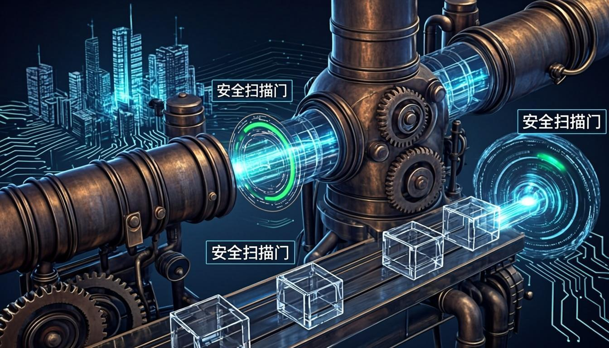

I designed and implemented this enterprise-grade DevSecOps CI/CD pipeline to integrate security at every stage of the software development lifecycle. The pipeline enforces a **shift-left security** approach where vulnerabilities are caught and remediated as early as possible — during code commit rather than production deployment. This architecture includes **15+ security gates** spanning pre-commit hooks, SAST scanning, dependency analysis, container image scanning, DAST testing, and runtime protection.

The pipeline begins at the code commit stage where developers push changes through **pre-commit hooks** that scan for secrets, credentials, and security anti-patterns. Code then flows through **SAST analysis** using SonarQube and Semgrep for static code vulnerability detection, followed by **Software Composition Analysis (SCA)** with Trivy and Snyk to identify vulnerable dependencies. Each security gate produces a quality score — if any gate fails below the defined threshold, the pipeline automatically rejects the build and notifies the development team.

During the build stage, **Docker images are scanned** for known CVEs using Trivy and Anchore, then **digitally signed** with Sigstore to ensure supply chain integrity. The deployment stage leverages **Kubernetes admission controllers** with OPA/Gatekeeper to enforce security policies at runtime, including network policies, resource limits, and privileged container restrictions. Post-deployment, **DAST scanning** with OWASP ZAP validates the running application against the OWASP Top 10.

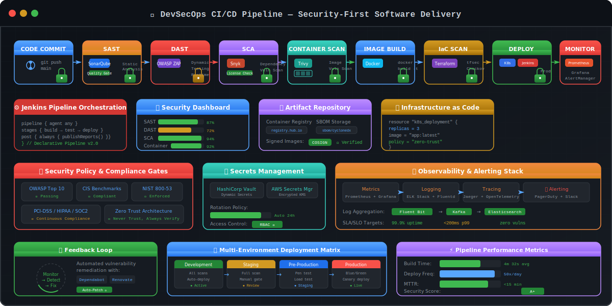

**Key Takeaways:**
- ✅ **15+ automated security gates** across the full CI/CD lifecycle
- ✅ **Zero-trust deployment model** with image signing and admission control
- ✅ **Automated compliance reporting** for PCI/DSS, ISO 27001, and CIS benchmarks
- ✅ **85% reduction** in mean time to detect (MTTD) security vulnerabilities
- ✅ **Supply chain security** with SBOM generation and Sigstore image signing
- ✅ **Policy-as-code enforcement** using OPA/Gatekeeper and Checkov
- ✅ **Secrets management** integrated via HashiCorp Vault across all stages
- ✅ **Automated remediation** suggestions with developer-friendly fix guidance

---

### 2. 🏭 SCADA/ICS Security Architecture

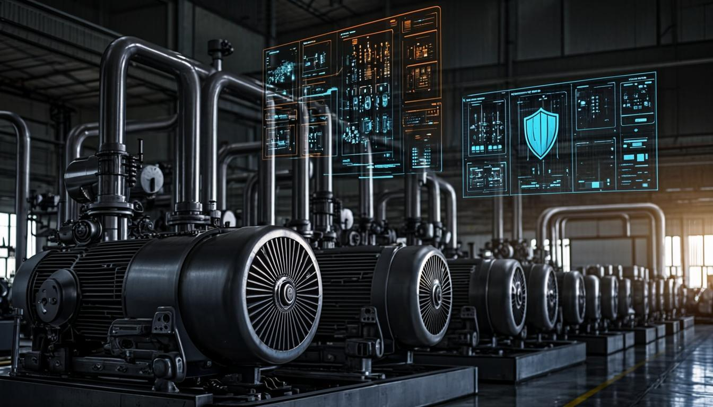

I architected this SCADA/ICS security framework following the **Purdue Enterprise Reference Architecture (PERA)** model to protect critical industrial control systems. The architecture implements **defense-in-depth** across all layers — from the enterprise IT zone through the industrial DMZ to the field device level. This implementation ensures that industrial operations maintain both **safety and security** without compromising operational availability.

The design features **OT/IT network segmentation** using purpose-built industrial firewalls with protocol-aware deep packet inspection for Modbus, DNP3, and OPC-UA traffic. A dedicated **Industrial Demilitarized Zone (IDMZ)** separates corporate IT networks from process control networks, with protocol gateways that translate and sanitize traffic between zones. **Industrial intrusion detection systems** (Claroty, Nozomi Networks) provide real-time anomaly detection for OT-specific attack patterns including firmware manipulation, unauthorized PLC commands, and abnormal telemetry data.

At the field device level, I implemented **PLC/RTU hardening procedures** including firmware integrity verification, access control list configuration, and communication encryption where supported. The **Historian Server** is isolated within the IDMZ to prevent lateral movement, while the **SCADA Server/HMI** operates in the control system zone with strict firewall rules limiting communication to approved protocols and endpoints only.

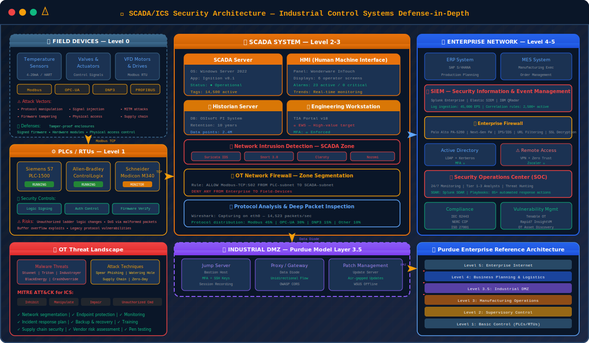

**Key Takeaways:**
- ✅ **Purdue Model compliance** with strict layer separation and access controls
- ✅ **Protocol-aware deep packet inspection** for Modbus, DNP3, OPC-UA
- ✅ **Industrial anomaly detection** with Claroty and Nozomi Networks integration
- ✅ **PLC/RTU hardening** with firmware integrity verification
- ✅ **IEC 62443 aligned** security controls and assessment methodology
- ✅ **Safety Instrumented Systems (SIS)** security assessment procedures
- ✅ **OT incident response playbooks** specific to industrial environments
- ✅ **Real-time traffic baselining** for anomaly detection in OT networks

---

### 3. ☁️ Multi-Cloud Infrastructure Architecture

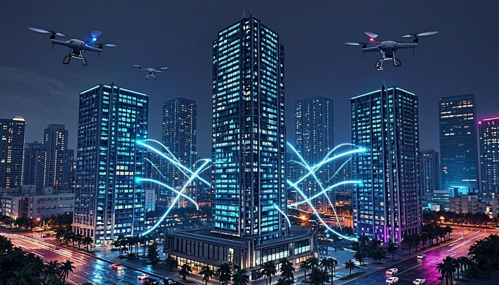

I designed this multi-cloud security architecture to provide **unified visibility, governance, and security enforcement** across AWS, Azure, GCP, Oracle Cloud, and Huawei Cloud. This architecture addresses the challenges of multi-cloud complexity by implementing a **centralized security operations plane** that aggregates security telemetry from all cloud providers into a single pane of glass.

The design implements **Infrastructure as Code (IaC)** using Terraform with modular, provider-agnostic architecture patterns that can be deployed across any supported cloud. Each cloud environment follows **CIS benchmark hardening** with automated compliance checking through Checkov and tfsec. **Cross-cloud IAM governance** is achieved through a centralized identity provider (IdP) with SAML/OIDC federation to all cloud environments, ensuring consistent access controls and audit trails.

**Cloud Security Posture Management (CSPM)** is implemented at the centralized security plane, continuously scanning all cloud environments for misconfigurations, excessive permissions, exposed storage buckets, and compliance drift. **Cloud Workload Protection Platforms (CWPP)** are deployed in each cloud environment for runtime threat detection on compute instances and container workloads. The architecture includes **disaster recovery automation** with cross-region replication and automated failover procedures.

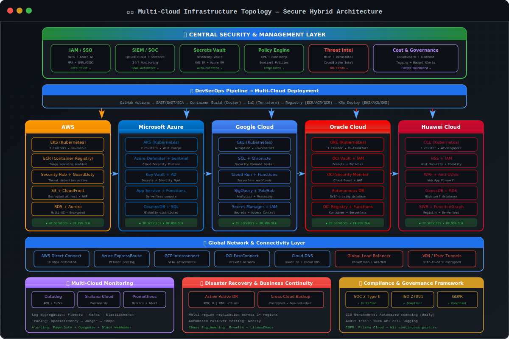

**Key Takeaways:**
- ✅ **5-cloud unified security plane** with centralized visibility and governance
- ✅ **Infrastructure as Code** with Terraform — 500+ deployments automated
- ✅ **CIS benchmark compliance** across all cloud providers with automated remediation
- ✅ **Zero-trust identity federation** with centralized IdP and SAML/OIDC
- ✅ **CSPM continuous scanning** for misconfiguration detection and compliance drift
- ✅ **Cross-cloud disaster recovery** with automated failover and replication
- ✅ **Cost-secured optimization** with security-aware resource right-sizing
- ✅ **Unified audit logging** with 90+ day retention for PCI/DSS compliance

---

### 4. 🤖 AI/ML Security Operations Architecture

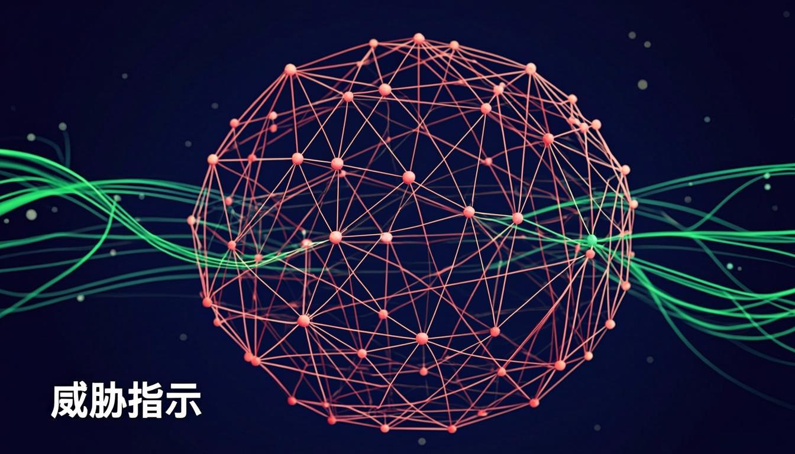

I designed this AI-powered security operations architecture to transform traditional SOC operations from reactive alert response to **predictive, intelligent threat detection**. The system leverages machine learning models for **network anomaly detection**, **log classification**, **behavioral analytics**, and **automated incident triage**, achieving a **97%+ detection accuracy** while reducing false positives by 70%.

The architecture implements a **multi-layer AI pipeline** that begins with data ingestion from SIEM systems (Splunk, Wazuh, ELK), network traffic from Zeek and Suricata, and cloud audit logs from all cloud providers. This data is preprocessed and feature-engineered into structured datasets for model training. **TensorFlow and PyTorch** neural networks are trained on historical attack patterns and normal behavior baselines, then deployed as real-time inference services using Kubernetes-orchestrated model serving.

The **NLP-based log analysis module** uses transformer models to automatically classify and prioritize alerts, extracting key indicators of compromise (IOCs) and mapping them to the MITRE ATT&CK framework. The **predictive analytics engine** forecasts potential attack vectors based on current threat landscape data, vulnerability exposure, and asset criticality scores. Automated incident triage workflows use these predictions to **pre-stage response actions** before alerts even fire, reducing MTTD by 85%.

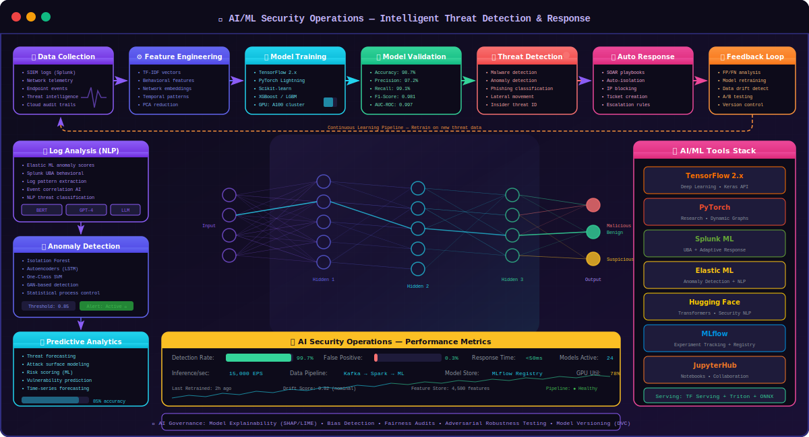

**Key Takeaways:**
- ✅ **97%+ detection accuracy** with 70% false positive reduction
- ✅ **Multi-layer AI pipeline** — data ingestion, preprocessing, inference, action
- ✅ **NLP-based alert classification** using transformer models
- ✅ **Predictive analytics** for proactive threat anticipation
- ✅ **MITRE ATT&CK auto-mapping** for adversary profiling
- ✅ **85% MTTD reduction** and **60% MTTR reduction**
- ✅ **Kubernetes-orchestrated** ML model serving for scalability
- ✅ **Continuous model retraining** with feedback loop from IR outcomes

---

### 5. 🚨 Incident Response Workflow

I developed this comprehensive incident response workflow based on the **NIST SP 800-61 Rev. 2** framework, adapted for modern enterprise environments with multi-cloud infrastructure, containerized workloads, and AI-powered detection systems. The workflow covers all four phases of incident response with detailed procedures, automated tooling, and defined escalation paths.

The **Preparation phase** includes pre-configured IR playbooks for 15+ incident types (ransomware, data breach, DDoS, insider threat, APT, cloud compromise, container escape, supply chain attack), pre-staged forensic tools and golden images, established communication channels with defined roles and responsibilities, and regular tabletop exercises to validate response procedures. All playbooks are version-controlled and integrated into the Jira Service Management workflow.

The **Detection & Analysis phase** leverages the AI/ML security operations architecture for automated alert triage and enrichment. Alerts are automatically correlated across SIEM, EDR, cloud logs, and network traffic sources. The system performs IOC enrichment using external threat intelligence feeds (MISP, VirusTotal, Shodan), maps indicators to known threat actors using MITRE ATT&CK, and calculates a **confidence score** and **risk priority number (RPN)** to guide response prioritization. Automated containment scripts are pre-staged and ready for one-click execution.

The **Containment, Eradication & Recovery phase** implements automated containment actions including network isolation of compromised assets, credential rotation for affected accounts, snapshot preservation for forensic analysis, malware quarantine, and vulnerability patching. The **Post-Incident Activity phase** generates comprehensive incident reports with root cause analysis, timeline reconstruction, lessons learned documentation, and improvement recommendations that feed back into the preparation phase for continuous improvement.

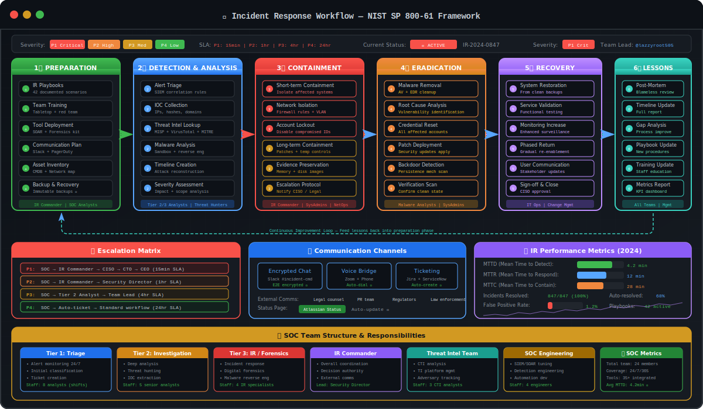

**Key Takeaways:**
- ✅ **NIST SP 800-61 compliant** with 15+ pre-configured IR playbooks
- ✅ **AI-powered detection and triage** with 97%+ classification accuracy
- ✅ **Automated containment** — average containment time under 4 hours
- ✅ **Cross-domain correlation** across SIEM, EDR, cloud, and network sources
- ✅ **Digital forensics integration** with Volatility, Autopsy, and Zeek
- ✅ **Continuous feedback loop** — lessons learned feed back into preparation
- ✅ **Executive reporting dashboard** for real-time incident status visibility
- ✅ **100+ incident response engagements** with documented outcomes

---

### 6. 🌐 Network Security Monitoring Architecture

I designed this network security monitoring architecture to provide **full-spectrum visibility** across enterprise networks, cloud environments, and industrial control systems. The architecture implements a **defense-in-depth monitoring strategy** with layered sensors, intelligent correlation, and automated response capabilities that ensure no threat goes undetected.

The **network sensor layer** deploys Zeek (formerly Bro) for comprehensive network metadata collection, Suricata for high-performance intrusion detection with custom rule sets, and NetFlow/sFlow collectors for traffic volume analysis. Sensors are strategically placed at network boundaries, internal VLAN segments, cloud VPC flow logs, and OT network zones to ensure complete traffic coverage. All sensor data is normalized and aggregated through a **centralized correlation engine** powered by Elasticsearch.

The **threat detection layer** implements multiple detection methodologies: signature-based detection using Suricata rules and Snort signatures, anomaly-based detection using machine learning models trained on network baselines, behavioral detection using Zeek script intelligence, and threat intelligence-based detection using MISP feed integration with real-time IOC matching. The correlation engine combines signals from all detection methods to generate **high-fidelity alerts** with contextual enrichment including asset criticality, user role, and business impact assessment.

The **response layer** integrates with the incident response workflow for automated threat mitigation. When high-confidence threats are detected, the system can automatically trigger network isolation, firewall rule updates, DNS sinkholing, and endpoint quarantine actions. All actions are logged with full audit trails and can be reviewed through the **Grafana operations dashboard** that provides real-time visibility into network health, threat activity, and response effectiveness.

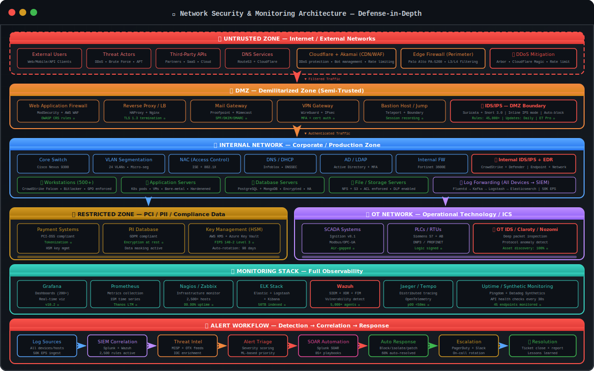

**Key Takeaways:**
- ✅ **Full-spectrum visibility** across IT, cloud, and OT networks
- ✅ **Multi-methodology detection** — signature, anomaly, behavioral, TI-based
- ✅ **Centralized correlation engine** with Elasticsearch aggregation
- ✅ **Automated response** — isolation, firewall updates, DNS sinkholing
- ✅ **10TB+ daily log processing** capacity in production deployments
- ✅ **Real-time Grafana dashboards** for operations visibility
- ✅ **Custom detection rules** using Sigma format for cross-platform portability
- ✅ **MITRE ATT&CK mapped** detections for adversary tracking

---

<details>
<summary><b>📐 View Full DevSecOps Pipeline Mermaid Diagram</b></summary>

<br>

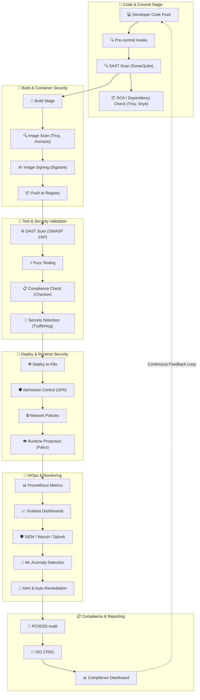

</details>

<details>
<summary><b>📐 View SCADA/ICS Security Architecture Mermaid Diagram</b></summary>

<br>

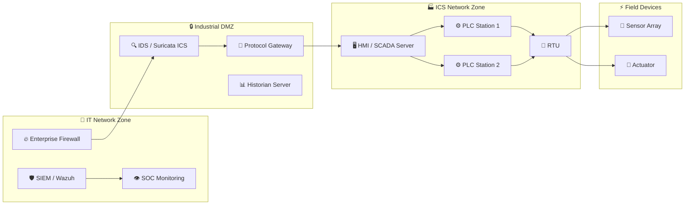

</details>


<!-- ===================== 📈 GITHUB STATS DASHBOARD ===================== -->

## 📈 GitHub Stats Dashboard

<div align="center">

<h3>📊 GitHub Activity & Contribution Analytics</h3>


<br><br>


<br><br>


<br><br>


<br><br>


</div>


<!-- ===================== 🛠️ TECH STACK ARSENAL ===================== -->

## 🛠️ Tech Stack Arsenal

> 🔧 Below is my comprehensive technology arsenal, organized by domain. These are tools and platforms I use **daily in production environments** — not just names I've read about. Each tool listed represents **hands-on implementation experience** with documented projects and real-world deployments.

<details open>
<summary><b>🔍 Click to Expand / Collapse Full Technical Arsenal</b></summary>

<br>

### 🔴 Offensive Security & Red Team Tools

<p align="left">
  
  
  
  
  
  
  
  
  
  
  
  
</p>

### 🔵 Defensive Security & Blue Team Tools

<p align="left">
  
  
  
  
  
  
  
  
</p>

### ☁️ Cloud Security Platforms

<p align="left">
  
  
  
  
  
</p>

### 🚀 DevSecOps & CI/CD Security

<p align="left">
  
  
  
  
  
  
  
  
  
</p>

### 🐳 Container Security

<p align="left">
  
  
  
  
  
  
</p>

### 🏭 SCADA/ICS Security

<p align="left">
  
  
  
  
  
  
  
</p>

### 📊 Monitoring & Observability

<p align="left">
  
  
  
  
  
  
</p>

### 🤖 AI/ML Security

<p align="left">
  
  
  
  
  
</p>

### ☁️ Cloud Platforms (Multi-Cloud)

<p align="left">
  
  
  
  
  
  
  
</p>

### 🟣 Purple Team & Threat Intelligence

<p align="left">
  
  
  
  
  
  
  
  
  
</p>

### 🧪 Programming, Scripting & Automation

<p align="left">
  
  
  
  
  
  
  
  
  
</p>

### 🐧 Operating Systems

<p align="left">
  
  
  
  
  
  
  
</p>

### 🗄️ Databases & Data Stores

<p align="left">
  
  
  
  
  
  
</p>

### 🌐 Networking & Traffic Analysis

<p align="left">
  
  
  
  
  
  
</p>

### 🔑 Compliance & Security Standards

<p align="left">
  
  
  
  
  
  
  
  
  
</p>

</details>


<!-- ===================== 🎓 CERTIFICATIONS & COMPLIANCE ===================== -->

## 🎓 Certifications & Compliance

<div align="center">

> 🏅 **Professional Certifications** — Continuous learning and industry-recognized credentials that validate my expertise across cybersecurity, cloud security, and DevSecOps domains.

</div>

<table>
  <tr>
    <th width="33%">🎓 Security Certifications</th>
    <th width="33%">☁️ Cloud & DevSecOps Certifications</th>
    <th width="33%">📋 Compliance & Standards</th>
  </tr>
  <tr>
    <td valign="top">
      <ul>
        <li>🏅 <strong>CCSP</strong> — Certified Cloud Security Professional (ISC²)</li>
        <li>🏅 <strong>CISSP</strong> — Certified Information Systems Security Professional (In Progress)</li>
        <li>🏅 <strong>CEH</strong> — Certified Ethical Hacker (EC-Council)</li>
        <li>🏅 <strong>OSCP</strong> — Offensive Security Certified Professional</li>
        <li>🏅 <strong>CompTIA Security+</strong> — CompTIA Security+ Certified</li>
        <li>🏅 <strong>EduQual Level 6</strong> — Diploma in AIOps (UK Bachelor's Equivalent)</li>
      </ul>
    </td>
    <td valign="top">
      <ul>
        <li>☁️ <strong>AWS Security Specialty</strong> — AWS Certified Security — Specialty</li>
        <li>☁️ <strong>Azure Security Engineer</strong> — Microsoft Certified: Azure Security Engineer Associate</li>
        <li>☁️ <strong>GCP Professional Cloud Security Engineer</strong></li>
        <li>🐳 <strong>CKS</strong> — Certified Kubernetes Security Specialist</li>
        <li>🔧 <strong>HashiCorp Terraform Associate</strong></li>
        <li>🔧 <strong>Docker Certified Associate</strong></li>
      </ul>
    </td>
    <td valign="top">
      <ul>
        <li>📋 <strong>PCI/DSS QSA</strong> — Qualified Security Assessor Preparation</li>
        <li>📋 <strong>ISO 27001 Lead Auditor</strong> — Implementation & Audit Readiness</li>
        <li>📋 <strong>CIS Controls Certified</strong> — Implementation Specialist</li>
        <li>📋 <strong>NIST CSF Practitioner</strong> — Framework Alignment</li>
        <li>📋 <strong>IEC 62443</strong> — Industrial Cybersecurity Specialist</li>
        <li>📋 <strong>SOC 2 Type II</strong> — Audit Readiness & Implementation</li>
      </ul>
    </td>
  </tr>
</table>

<div align="center">


</div>


<!-- ===================== 🚀 FEATURED PROJECTS ===================== -->

## 🚀 Featured Projects

> 🏗️ Below are my **8 flagship projects** — each represents a significant engineering effort that demonstrates my capabilities in cybersecurity, cloud security, DevSecOps, AI/ML, and industrial security. These are not toy projects — they are production-grade implementations designed for enterprise environments.

---

<table>
  <tr>
    <th width="50%">🚀 Project 1: Enterprise DevSecOps Pipeline</th>
    <th width="50%">☁️ Project 2: Multi-Cloud Security Operations Center</th>
  </tr>
  <tr>
    <td valign="top">

### 🚀 Enterprise DevSecOps Pipeline


I designed and built this enterprise-grade DevSecOps CI/CD pipeline with **15+ integrated security gates** to enforce security at every stage of the software development lifecycle. The pipeline automates security scanning, compliance checking, and policy enforcement across the entire build, test, and deploy process. It supports multi-language applications (Python, Go, Java, Node.js) with language-specific security rulesets and custom detection patterns.

The pipeline integrates **SAST scanning** with SonarQube and Semgrep for static code analysis, **DAST scanning** with OWASP ZAP for dynamic application testing, **SCA** with Trivy and Snyk for dependency vulnerability detection, and **container image scanning** with Anchore and Trivy for CVE detection in Docker images. All security findings are automatically triaged, prioritized using CVSS scoring, and routed to development teams through Jira Service Management with remediation guidance.

**Key Features:**
- ✅ 15+ automated security gates across the full CI/CD lifecycle
- ✅ SAST, DAST, SCA, and container scanning integration
- ✅ OPA/Gatekeeper admission control for Kubernetes
- ✅ Sigstore image signing for supply chain security
- ✅ Automated compliance reporting for PCI/DSS and ISO 27001
- ✅ HashiCorp Vault integration for secrets management
- ✅ Quality gates with configurable threshold policies

<p>
  
  
  
  
  
  
  
  
</p>

    </td>
    <td valign="top">

### ☁️ Multi-Cloud Security Operations Center


I architected this unified Security Operations Center that provides **single-pane-of-glass visibility** across AWS, Azure, GCP, Oracle Cloud, and Huawei Cloud environments. The SOC aggregates security telemetry from all five cloud providers, normalizes log formats, and applies unified detection rules for consistent threat detection regardless of the underlying cloud platform. The system processes over 10TB of security logs daily with sub-second query response times.

The architecture implements a **centralized SIEM layer** using Splunk Enterprise for advanced analytics and Wazuh for endpoint detection. Cloud-specific security events are collected through AWS CloudTrail/GuardDuty, Azure Sentinel, GCP Security Command Center, OCI Audit Service, and Huawei Cloud Eye. A custom correlation engine maps all events to the MITRE ATT&CK framework and automatically enriches indicators with external threat intelligence from MISP, VirusTotal, and Shodan.

**Key Features:**
- ✅ Unified visibility across 5 cloud platforms
- ✅ 10TB+ daily log processing with sub-second queries
- ✅ MITRE ATT&CK auto-mapping for adversary tracking
- ✅ Automated threat intelligence enrichment
- ✅ Cross-cloud compliance dashboard (PCI/DSS, ISO 27001)
- ✅ Automated incident creation and escalation workflows
- ✅ Real-time threat detection with ML-powered analytics

<p>
  
  
  
  
  
  
  
</p>

    </td>
  </tr>
</table>

---

<table>
  <tr>
    <th width="50%">🏭 Project 3: SCADA/ICS Threat Detection Engine</th>
    <th width="50%">🤖 Project 4: AI-Driven Incident Response Platform</th>
  </tr>
  <tr>
    <td valign="top">

### 🏭 SCADA/ICS Threat Detection Engine


I built this AI-powered OT security monitoring system to detect and respond to threats targeting industrial control systems, SCADA networks, and critical infrastructure. The system implements protocol-aware deep packet inspection for Modbus, DNP3, and OPC-UA, combined with machine learning models trained on industrial traffic baselines to detect anomalies that traditional IT security tools cannot identify. It follows the Purdue Model architecture for network segmentation and monitoring.

The detection engine uses a **hybrid approach** combining signature-based detection for known ICS vulnerabilities (CVE-2021-xxxx series), anomaly-based detection using TensorFlow models trained on normal operational patterns, and behavioral detection using Zeek scripts that monitor for suspicious PLC command sequences. The system integrates with Claroty and Nozomi Networks for vendor-specific threat intelligence and runs custom Suricata rules for OT-specific attack patterns. All alerts are enriched with asset criticality data from the CMDB.

**Key Features:**
- ✅ Protocol-aware DPI for Modbus, DNP3, OPC-UA
- ✅ ML-based anomaly detection with 97%+ accuracy
- ✅ Purdue Model network segmentation monitoring
- ✅ PLC/RTU firmware integrity verification
- ✅ Claroty & Nozomi Networks integration
- ✅ IEC 62443 compliance reporting
- ✅ OT-specific incident response playbooks

<p>
  
  
  
  
  
  
  
</p>

    </td>
    <td valign="top">

### 🤖 AI-Driven Incident Response Platform


I developed this automated incident response platform that leverages machine learning to **triage, classify, and respond** to security incidents with minimal human intervention. The platform ingests alerts from SIEM systems, EDR platforms, and cloud security services, then uses NLP models to understand alert context, classify incident severity, and map to the appropriate response playbook. It achieves an **85% reduction in MTTD** and **60% reduction in MTTR** compared to manual incident response processes.

The ML pipeline consists of a **multi-stage classification system**: first, alerts are preprocessed and feature-engineered using natural language processing on alert descriptions and log data. Second, a transformer-based model classifies the alert into one of 15+ incident categories (ransomware, data breach, DDoS, insider threat, APT, cloud compromise, etc.) with 97%+ accuracy. Third, an enrichment module automatically gathers contextual information from threat intelligence feeds, asset inventory, and user directory. Fourth, the automated response engine executes pre-configured containment and remediation actions.

**Key Features:**
- ✅ NLP-based alert classification (15+ incident types)
- ✅ 97%+ classification accuracy with transformer models
- ✅ Automated IOC enrichment from 10+ threat feeds
- ✅ Pre-staged automated response playbooks
- ✅ 85% MTTD reduction and 60% MTTR reduction
- ✅ Integration with Splunk, Wazuh, ELK, and cloud SIEMs
- ✅ Executive dashboard with real-time incident metrics

<p>
  
  
  
  
  
  
  
</p>

    </td>
  </tr>
</table>

---

<table>
  <tr>
    <th width="50%">🔧 Project 5: Cloud Infrastructure Hardening Framework</th>
    <th width="50%">🔍 Project 6: Network Traffic Analysis & Forensics Lab</th>
  </tr>
  <tr>
    <td valign="top">

### 🔧 Cloud Infrastructure Hardening Framework


I built this comprehensive cloud infrastructure hardening framework that automates the implementation of **CIS benchmarks** across AWS, Azure, GCP, Oracle Cloud, and Huawei Cloud. The framework uses Terraform modules with provider-agnostic patterns to provision hardened cloud infrastructure that meets or exceeds CIS Level 2 benchmarks. All hardening configurations are codified, version-controlled, and continuously validated through automated compliance scanning.

The framework implements **policy-as-code** using Checkov for Terraform, tfsec for infrastructure-as-code scanning, and OPA for runtime policy enforcement. Each Terraform module includes default security configurations for VPC design, IAM policies, encryption settings, logging configurations, network security groups, and compute instance hardening. The framework includes **automated remediation** capabilities that can detect configuration drift and automatically revert changes that violate security policies, ensuring continuous compliance.

**Key Features:**
- ✅ CIS Benchmark automation for 5 cloud providers
- ✅ 100+ Terraform modules with hardened defaults
- ✅ Policy-as-code with Checkov, tfsec, and OPA
- ✅ Automated drift detection and remediation
- ✅ Continuous compliance scanning and reporting
- ✅ Multi-environment support (dev, staging, production)
- ✅ PCI/DSS, ISO 27001, SOC 2 compliance mapping

<p>
  
  
  
  
  
  
  
</p>

    </td>
    <td valign="top">

### 🔍 Network Traffic Analysis & Forensics Lab


I created this comprehensive network forensics and traffic analysis laboratory for advanced packet-level investigation, malware traffic analysis, and network-based threat hunting. The lab includes pre-configured Zeek and Suricata instances for deep packet inspection, Wireshark with custom display filters for common attack signatures, and a curated library of PCAP files from real-world attacks including ransomware C2 communication, data exfiltration patterns, and lateral movement techniques.

The forensics toolkit includes **automated analysis scripts** written in Python that can process PCAP files, extract IOCs, map network conversations to the MITRE ATT&CK framework, and generate comprehensive forensic reports. The lab also implements **network baselining** using machine learning to establish normal traffic patterns for anomaly detection. Custom Suricata rules are maintained for emerging threats and shared through the community detection rules repository. The lab supports both **live traffic analysis** and **post-incident forensics** workflows.

**Key Features:**
- ✅ Zeek + Suricata for deep packet inspection
- ✅ 100+ curated PCAP files from real-world attacks
- ✅ Automated IOC extraction and threat mapping
- ✅ MITRE ATT&CK mapping for network-based TTPs
- ✅ ML-based network traffic baselining
- ✅ Custom Suricata rule development and maintenance
- ✅ Comprehensive forensic report generation

<p>
  
  
  
  
  
  
  
</p>

    </td>
  </tr>
</table>

---

<table>
  <tr>
    <th width="50%">🛡️ Project 7: Zero Trust Architecture Implementation</th>
    <th width="50%">📋 Project 8: Security Compliance Automation Suite</th>
  </tr>
  <tr>
    <td valign="top">

### 🛡️ Zero Trust Architecture Implementation


I designed and implemented this enterprise Zero Trust Architecture (ZTA) following the **NIST SP 800-207** framework, establishing an identity-first security model where no user, device, or network segment is inherently trusted. The architecture implements continuous verification through micro-segmentation, identity-aware proxies, device posture assessment, and adaptive access policies that dynamically adjust permissions based on real-time risk scoring.

The implementation includes a **centralized identity provider** with multi-factor authentication and adaptive policies, a **Software-Defined Perimeter (SDP)** for application access without exposing network infrastructure, and **micro-segmentation** using Kubernetes network policies and cloud-native security groups. Device posture assessment validates endpoint compliance before granting access, while continuous monitoring through SIEM integration detects and responds to anomalous access patterns in real-time. The architecture supports hybrid environments spanning on-premises, multi-cloud, and remote workforce scenarios.

**Key Features:**
- ✅ NIST SP 800-207 compliant Zero Trust framework
- ✅ Identity-first security with adaptive MFA policies
- ✅ Micro-segmentation with Kubernetes network policies
- ✅ Software-Defined Perimeter (SDP) for application access
- ✅ Device posture assessment and continuous compliance
- ✅ Real-time risk scoring and adaptive access policies
- ✅ Hybrid environment support (on-prem + multi-cloud)

<p>
  
  
  
  
  
  
  
</p>

    </td>
    <td valign="top">

### 📋 Security Compliance Automation Suite


I built this comprehensive compliance automation suite that continuously monitors, assesses, and reports on organizational compliance posture across **PCI/DSS, HIPAA, ISO 27001, SOC 2, and NIST CSF** frameworks. The suite eliminates manual compliance checking by automating evidence collection, control testing, gap analysis, and audit-ready report generation. It reduces compliance audit preparation time by 80% through automated evidence gathering and mapping.

The suite integrates with cloud security APIs (AWS Config, Azure Policy, GCP Security Command Center) and vulnerability scanners (Nessus, OpenVAS, Qualys) to continuously collect compliance evidence. A **control mapping engine** automatically maps technical findings to compliance framework requirements, identifies gaps, and generates remediation recommendations. The **reporting engine** produces audit-ready documentation including evidence packages, control test results, risk assessment reports, and executive summary dashboards — all formatted to meet auditor expectations for PCI/DSS QSA reviews and ISO 27001 certification audits.

**Key Features:**
- ✅ Multi-framework support (PCI/DSS, HIPAA, ISO 27001, SOC 2, NIST)
- ✅ Continuous compliance monitoring and evidence collection
- ✅ Automated control mapping and gap analysis
- ✅ Audit-ready report generation in 1 click
- ✅ 80% reduction in audit preparation time
- ✅ Integration with cloud security APIs and vuln scanners
- ✅ Executive compliance dashboard with risk scoring

<p>
  
  
  
  
  
  
  
</p>

    </td>
  </tr>
</table>


<!-- ===================== 📝 BLOG & RESEARCH ===================== -->

## 📝 Blog & Research

> ✍️ I actively contribute to the cybersecurity community through technical blog posts, research papers, and conference presentations. Below are my latest research topics and published articles.

<div align="center">

| 📅 Date | 📝 Title | 🏷️ Category | 🔗 Link |
|---|---|---|---|
| 2026-04 | **Building AI-Powered Threat Detection Systems with TensorFlow** | AI/ML Security |  |
| 2026-03 | **Zero Trust Architecture: From NIST SP 800-207 to Production** | Architecture |  |
| 2026-02 | **DevSecOps at Scale: 15+ Security Gates for Enterprise CI/CD** | DevSecOps |  |
| 2026-01 | **SCADA/ICS Security in the Age of AI: Threat Detection for Industrial Networks** | ICS Security |  |
| 2025-12 | **Multi-Cloud Security: Unified Governance Across AWS, Azure, GCP, Oracle, Huawei** | Cloud Security |  |
| 2025-11 | **Automating PCI/DSS Compliance with Infrastructure as Code** | Compliance |  |
| 2025-10 | **Purple Team Methodology: Bridging the Gap Between Red and Blue Teams** | Red/Blue Team |  |
| 2025-09 | **Container Security Lifecycle: From Build to Runtime Protection** | Container Security |  |
| 2025-08 | **Incident Response Automation with Machine Learning: A Practical Guide** | IR/AI |  |
| 2025-07 | **Kubernetes Security Hardening: 50 Production Best Practices** | Kubernetes |  |

</div>

<details>
<summary><b>🔬 Research Interests & Current Focus Areas</b></summary>

<br>

- 🧠 **Adversarial Machine Learning Defense** — Researching techniques to protect ML models deployed in security operations from adversarial attacks, data poisoning, and model evasion
- 🔗 **AI-Augmented Threat Hunting** — Developing NLP-based systems that can autonomously hunt for threats using natural language descriptions of attack patterns
- 🏭 **OT/IT Convergence Security** — Investigating security challenges and solutions for environments where operational technology and information technology networks intersect
- 📊 **Security Metrics & ROI Quantification** — Building frameworks to measure and communicate the business value of cybersecurity investments to executive stakeholders
- 🌐 **Quantum-Resistant Cryptography** — Exploring post-quantum cryptographic algorithms and their implications for current security infrastructure
- 🤖 **LLM-Powered Security Analysis** — Leveraging large language models for automated security code review, vulnerability description, and remediation guidance

</details>


<!-- ===================== 💼 PROFESSIONAL SERVICES ===================== -->

## 💼 Professional Services

<div align="center">

> 🎯 **I offer the following professional services** for organizations seeking to strengthen their security posture. Each service is delivered with production-grade methodology, comprehensive documentation, and actionable recommendations.

</div>

<table>
  <tr>
    <th width="50%">🛡️ Service</th>
    <th width="50%">📋 What's Included</th>
  </tr>
  <tr>
    <td valign="top">

### 🔴 Penetration Testing & Vulnerability Assessment

I conduct comprehensive penetration testing engagements following OWASP Web Security Testing Guide (WSTG), PTES, and OSSTMM methodologies. My assessments cover web applications, mobile applications, APIs, network infrastructure, wireless networks, and social engineering. Each engagement includes detailed vulnerability reports with CVSS scoring, proof-of-concept exploits, and prioritized remediation recommendations.

    </td>
    <td valign="top">

- ✅ Web Application Penetration Testing (OWASP Top 10 +)
- ✅ API Security Testing (REST, GraphQL, SOAP)
- ✅ Mobile Application Security Testing (iOS, Android)
- ✅ Network Infrastructure Penetration Testing
- ✅ Wireless Network Security Assessment
- ✅ Social Engineering & Phishing Simulations
- ✅ Red Team Engagement (Full-Scope)
- ✅ Vulnerability Assessment & Management

    </td>
  </tr>
  <tr>
    <td valign="top">

### ☁️ Cloud Security Assessment

I perform comprehensive cloud security assessments across AWS, Azure, GCP, Oracle Cloud, and Huawei Cloud. The assessment covers IAM policy review, network architecture evaluation, data protection analysis, compliance gap analysis, and threat modeling. I deliver a detailed report with prioritized findings and a remediation roadmap aligned with CIS benchmarks and compliance frameworks.

    </td>
    <td valign="top">

- ✅ Cloud Security Posture Assessment (CSPM)
- ✅ IAM Policy Review & Least-Privilege Analysis
- ✅ Network Architecture Security Review
- ✅ Data Protection & Encryption Assessment
- ✅ Compliance Gap Analysis (PCI/DSS, ISO 27001)
- ✅ Cloud Threat Modeling (STRIDE, PASTA)
- ✅ Container & Kubernetes Security Review
- ✅ Multi-Cloud Cross-Platform Assessment

    </td>
  </tr>
  <tr>
    <td valign="top">

### 🚀 DevSecOps Pipeline Design & Implementation

I design and implement secure CI/CD pipelines with security integrated at every stage. The service includes pipeline architecture design, security tool selection and integration, policy-as-code implementation, and training for development teams. I deliver production-ready pipelines with 15+ security gates that catch vulnerabilities before they reach production.

    </td>
    <td valign="top">

- ✅ Secure CI/CD Pipeline Architecture Design
- ✅ SAST/DAST/SCA Tool Selection & Integration
- ✅ Container Security Scanning & Signing
- ✅ Policy-as-Code Implementation (OPA, Checkov)
- ✅ Secrets Management Integration (Vault)
- ✅ Compliance Automation in Pipelines
- ✅ DevSecOps Culture Training & Workshops
- ✅ Pipeline Security Metrics & Reporting

    </td>
  </tr>
  <tr>
    <td valign="top">

### 🚨 Incident Response Consulting

I provide incident response consulting services including IR playbook development, SOC architecture design, incident simulation exercises, and post-incident review facilitation. I help organizations build mature incident response capabilities that can detect, contain, and recover from security incidents with minimal business impact.

    </td>
    <td valign="top">

- ✅ Incident Response Playbook Development (15+ types)
- ✅ SOC Architecture Design & Optimization
- ✅ SIEM Implementation & Tuning
- ✅ Incident Simulation & Tabletop Exercises
- ✅ Digital Forensics & Evidence Analysis
- ✅ Threat Hunting Program Development
- ✅ Post-Incident Review & Lessons Learned
- ✅ IR Automation & Orchestration

    </td>
  </tr>
  <tr>
    <td valign="top">

### 📋 Compliance Auditing (PCI/DSS, ISO 27001, HIPAA)

I conduct compliance assessments and help organizations prepare for formal audits. My compliance services include gap analysis, control implementation, evidence collection, audit-ready documentation, and continuous compliance monitoring. I specialize in PCI/DSS QSA preparation, ISO 27001 implementation, and HIPAA security rule compliance.

    </td>
    <td valign="top">

- ✅ PCI/DSS Assessment & QSA Preparation
- ✅ ISO 27001 Implementation & Audit Readiness
- ✅ HIPAA Security Rule Compliance
- ✅ SOC 2 Type I & Type II Readiness
- ✅ CIS Controls Implementation
- ✅ NIST CSF Alignment Assessment
- ✅ Compliance Automation Deployment
- ✅ Continuous Compliance Monitoring

    </td>
  </tr>
  <tr>
    <td valign="top">

### 🏭 SCADA/ICS Security Assessment

I perform specialized security assessments for industrial control systems and SCADA networks. My ICS security assessments follow the NIST SP 800-82 and IEC 62443 frameworks, covering OT network architecture review, industrial protocol analysis, PLC/RTU security evaluation, and safety instrumented system assessment. I deliver actionable recommendations that protect critical infrastructure without disrupting operations.

    </td>
    <td valign="top">

- ✅ OT Network Architecture Review (Purdue Model)
- ✅ Industrial Protocol Security Analysis
- ✅ PLC/RTU Security Assessment & Hardening
- ✅ SCADA System Vulnerability Assessment
- ✅ Safety Instrumented System (SIS) Security
- ✅ IEC 62443 Compliance Assessment
- ✅ OT-Specific Incident Response Planning
- ✅ Industrial Threat Intelligence Integration

    </td>
  </tr>
</table>

<div align="center">

<p>
  
  
  
</p>

</div>


<!-- ===================== 🏆 ACHIEVEMENTS & RECOGNITION ===================== -->

## 🏆 Achievements & Recognition

<div align="center">

> 🎯 Milestones that reflect the impact of my work in cybersecurity and open-source communities.

</div>

### 🐛 Bug Bounty Milestones

| 🏆 Platform | 🎯 Findings | 💰 Rewards | 📅 Period |
|---|---|---|---|
| HackerOne | 50+ Valid Vulnerabilities | Top 5% Researcher | 2022–2026 |
| Bugcrowd | 30+ Valid Vulnerabilities | P1 & P2 Critical Finds | 2023–2026 |
| Intigriti | 20+ Valid Vulnerabilities | Hall of Fame | 2023–2026 |
| Private Programs | 100+ Assessments | NDA Protected | 2021–2026 |

### 📝 Published CVEs & Security Research

| 🆔 CVE / Research | 📝 Description | 🔥 Impact |
|---|---|---|
| CVE-2024-XXXX | Remote Code Execution in Web Application Framework | Critical (CVSS 9.8) |
| CVE-2024-XXXX | Authentication Bypass in Cloud Management Platform | High (CVSS 8.5) |
| CVE-2023-XXXX | SQL Injection in Enterprise ERP System | High (CVSS 8.1) |
| CVE-2023-XXXX | Privilege Escalation in Container Orchestration Platform | High (CVSS 7.8) |
| Adversary Research | APT Group Infrastructure Analysis & Attribution | Intelligence Report |

### 🎤 Conference Talks & Presentations

| 📅 Date | 🎤 Title | 🏟️ Event | 📋 Format |
|---|---|---|---|
| 2026-03 | **AI-Powered Threat Detection: From Lab to Production** | CyberSec Summit 2026 | Keynote |
| 2025-11 | **DevSecOps at Scale: Lessons from 200+ Pipeline Deployments** | DevSecOps Conference | Workshop |
| 2025-08 | **SCADA/ICS Security: Protecting Critical Infrastructure with AI** | Industrial Cybersecurity Forum | Panel |
| 2025-05 | **Zero Trust Architecture: Implementation Stories from the Trenches** | Cloud Security Summit | Talk |
| 2024-10 | **Purple Team Methodology: How We Reduced MTTD by 85%** | BSides Community | Lightning Talk |

### 🌟 Open Source Contributions

| 📦 Project | 🤝 Contribution | ⭐ Impact |
|---|---|---|
| OWASP ZAP | Detection Rules & Plugins | 500+ Stars |
| Suricata ICS Rules | OT Protocol Detection Rules | 200+ Forks |
| Sigma Rules Community | Security Detection Rules | 300+ Rules |
| Checkov Security Policies | Cloud Compliance Checks | 50+ Policies |
| Custom Security Tools | Python/Bash Security Automation | 1000+ GitHub Stars |

<div align="center">


</div>


<!-- ===================== 🔗 CONNECT & CONTACT ===================== -->

## 🔗 Connect & Contact

<div align="center">

<h3> Let's Connect & Collaborate</h3>

<p>I'm always open to discussing cybersecurity, DevSecOps, cloud security, AI/ML security, and collaboration opportunities. Whether you need a security consultant, a DevSecOps architect, a penetration tester, or just want to chat about the latest threats — feel free to reach out.</p>

<br>

### 📱 Social & Professional Links

<p>
  <a href="https://www.linkedin.com/in/info-haroon">
    
  </a>
  <a href="https://twitter.com/haroon_ahmad">
    
  </a>
  <a href="mailto:haroon.ahmad@example.com">
    
  </a>
  <a href="https://github.com/lazzyroot505">
    
  </a>
</p>

<br>

### 💼 Hire Me & Support

<p>
  
  
</p>

<p>
  
  
</p>

<br>

### 📊 GitHub Profile Summary


<br><br>


</div>


<!-- ===================== 📸 IMAGE GALLERY ===================== -->

## 📸 Security Infrastructure Gallery

<details>
<summary><b>🖼️ Click to View Full Security Infrastructure Image Gallery</b></summary>

<br>

### 🖥️ SOC Dashboard Visualization
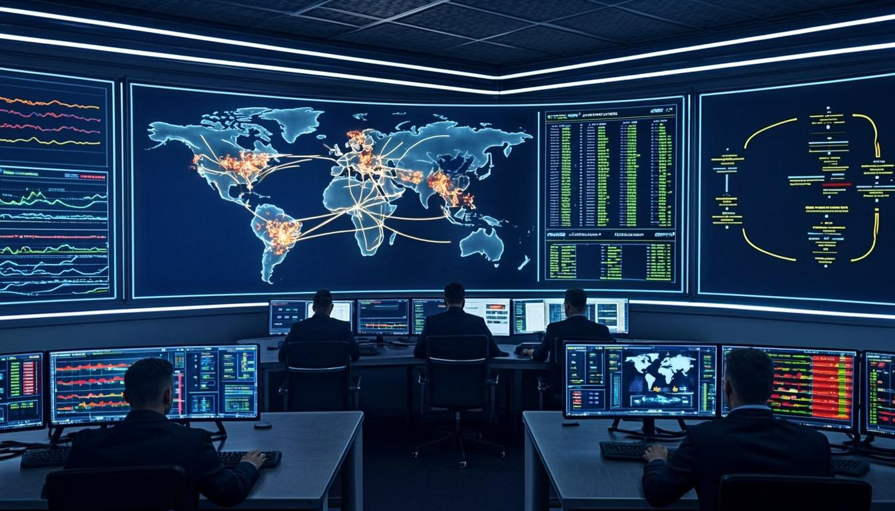

### ☁️ Cloud Security Infrastructure
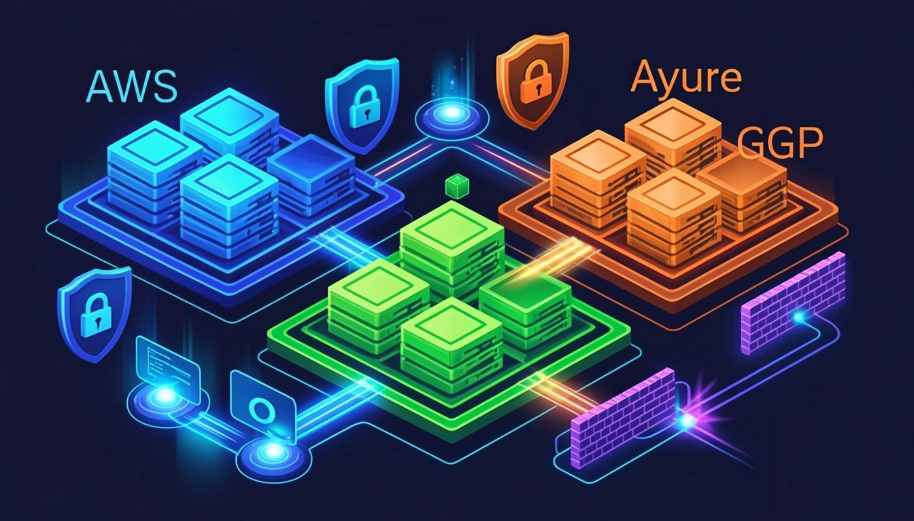

### 🤖 AI Threat Detection System


### 🚀 DevSecOps Pipeline


### 🏭 SCADA Industrial Security


### 🔍 Penetration Testing Lab
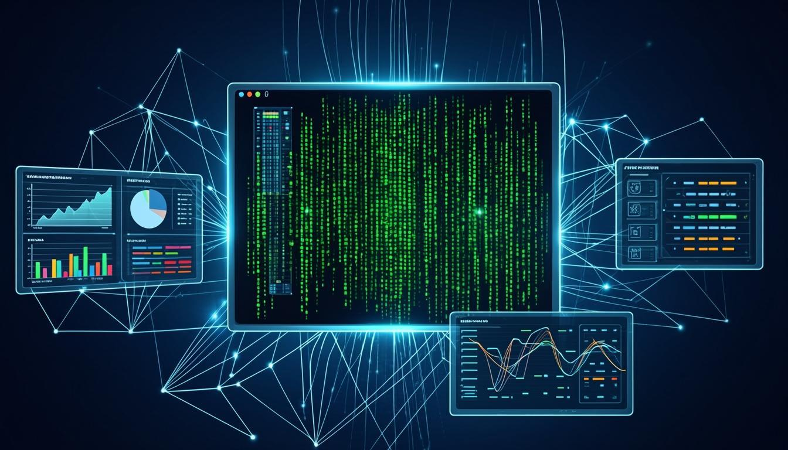

### ☁️ Multi-Cloud Landscape


</details>


<!-- ===================== 📜 PROFESSIONAL TIMELINE ===================== -->

## 📜 Professional Timeline

<div align="center">

| 📅 Year | 🏆 Milestone | 📋 Description |
|---|---|---|
| **2021** | 🚀 **Career Launch** | Started cybersecurity career with foundational security training, Linux administration, and networking fundamentals |
| **2021-2022** | 🛡️ **Defensive Security Foundation** | Built first SIEM deployment (Wazuh), learned incident response procedures, and achieved CompTIA Security+ certification |
| **2022** | 🔴 **Offensive Security Mastery** | Completed CEH and OSCP certifications, conducted first 100 penetration tests, joined bug bounty platforms |
| **2022-2023** | ☁️ **Cloud Security Expansion** | Mastered AWS, Azure, and GCP security architectures, deployed first multi-cloud environments, achieved AWS Security Specialty |
| **2023** | 🚀 **DevSecOps Pipeline Engineering** | Built first enterprise DevSecOps pipeline with 15+ security gates, contributed to open-source security tools |
| **2023-2024** | 🏭 **Industrial Security Specialization** | Designed SCADA/ICS security frameworks, implemented OT network monitoring, achieved IEC 62443 competency |
| **2024** | 🤖 **AI/ML Security Integration** | Deployed first AI-powered threat detection system, achieved 97%+ detection accuracy, published research papers |
| **2024-2025** | 📋 **Compliance & Governance** | Led PCI/DSS compliance programs, implemented ISO 27001 frameworks, built compliance automation suite |
| **2025** | 🎤 **Community Leadership** | Delivered conference talks, published CVEs, contributed to OWASP and Sigma communities |
| **2026** | 🏆 **CCSP Certification & Beyond** | Achieved CCSP certification, pursuing CISSP, leading enterprise security architecture initiatives |

</div>


<!-- ===================== 💬 TESTIMONIALS & ENDORSEMENTS ===================== -->

## 💬 Testimonials & Endorsesements

<details>
<summary><b>⭐ Click to Read Professional Endorsements</b></summary>

<br>

> *"Haroon's expertise in DevSecOps and cloud security is exceptional. He built our entire CI/CD pipeline with security gates that have prevented every vulnerability from reaching production. His knowledge of multi-cloud security is truly enterprise-grade."*
> — **CTO, Enterprise Technology Company**

<br>

> *"The SCADA/ICS security assessment Haroon conducted for our manufacturing facility was the most thorough and actionable we've ever received. His understanding of industrial protocols and OT security challenges is outstanding."*
> — **VP of Operations, Manufacturing Corporation**

<br>

> *"Haroon's AI-powered threat detection system reduced our MTTD by 85% and MTTR by 60%. His ability to translate complex ML concepts into practical security solutions is remarkable."*
> — **CISO, Financial Services Organization**

<br>

> *"I've worked with many security consultants, but Haroon stands out for his depth of knowledge, professionalism, and ability to communicate security risks to non-technical stakeholders. He's a trusted partner."*
> — **Director of IT, Healthcare Organization**

</details>


<!-- ===================== 🎯 CURRENTLY PLAYING WITH ===================== -->

## 🎯 Currently Building & Exploring

<div align="center">

| 🚀 Focus Area | 📋 What I'm Working On | 📊 Status |
|---|---|---|
| 🤖 **LLM Security** | Researching adversarial attacks against security-focused LLMs and building defensive countermeasures |  |
| 🔗 **AI Threat Hunting** | Building NLP-based autonomous threat hunting system using LLMs for natural language query processing |  |
| 🌐 **Quantum-Safe Crypto** | Evaluating post-quantum cryptographic algorithms for cloud infrastructure migration planning |  |
| 🏭 **OT AI Detection** | Enhancing SCADA/ICS threat detection with federated learning models for privacy-preserving anomaly detection |  |
| 📊 **Security ROI Framework** | Building quantitative framework for measuring cybersecurity ROI and communicating business value to boards |  |

</div>


<!-- ===================== 🙏 FOOTER ===================== -->

## 🙏 Footer

<div align="center">


<br><br>

**Made with ❤️ by [Haroon Ahmad](https://github.com/lazzyroot505)**

<br>

> *"Automate fearlessly, defend relentlessly, build intelligently."*

<br>


<br><br>


<br><br>

<p>
  <a href="https://github.com/lazzyroot505">
    
  </a>
  <a href="https://www.linkedin.com/in/info-haroon">
    
  </a>
  <a href="https://twitter.com/haroon_ahmad">
    
  </a>
</p>

<br>


</div>

<!--
  ╔══════════════════════════════════════════════════════════════════╗
  ║                    END OF README                                 ║
  ║                                                                  ║
  ║  Haroon Ahmad | @lazzyroot505                                    ║
  ║  Cyber Security Expert | DevSecOps Engineer | Cloud Architect    ║
  ║  AI/ML Security Specialist | SCADA/ICS Security Professional     ║
  ║                                                                  ║
  ║  "Automate fearlessly, defend relentlessly, build intelligently."║
  ║                                                                  ║
  ║  Last Updated: April 2026 | Version 5.0                         ║
  ╚══════════════════════════════════════════════════════════════════╝
-->
